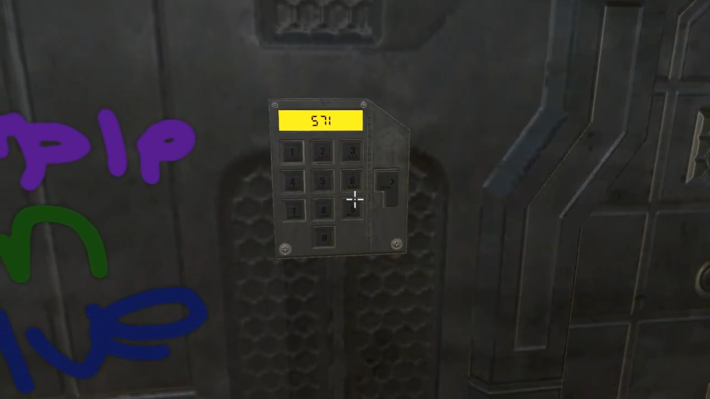
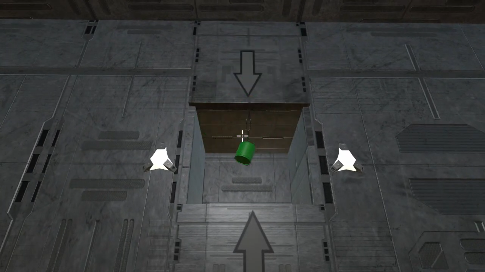
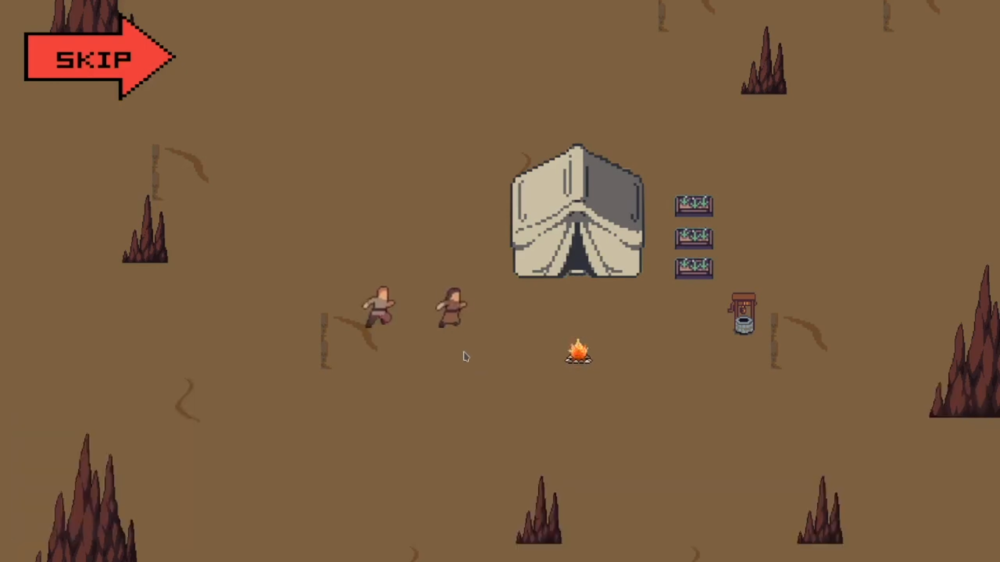
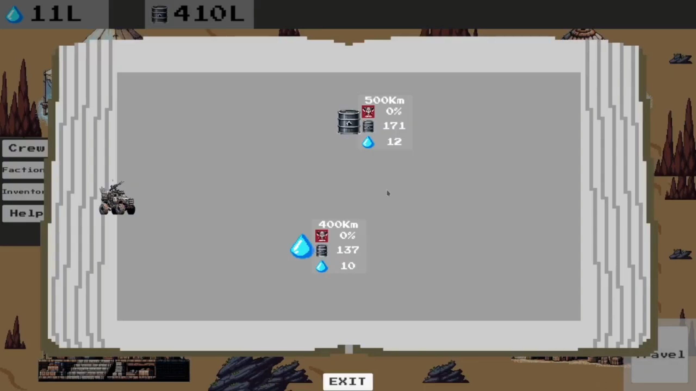
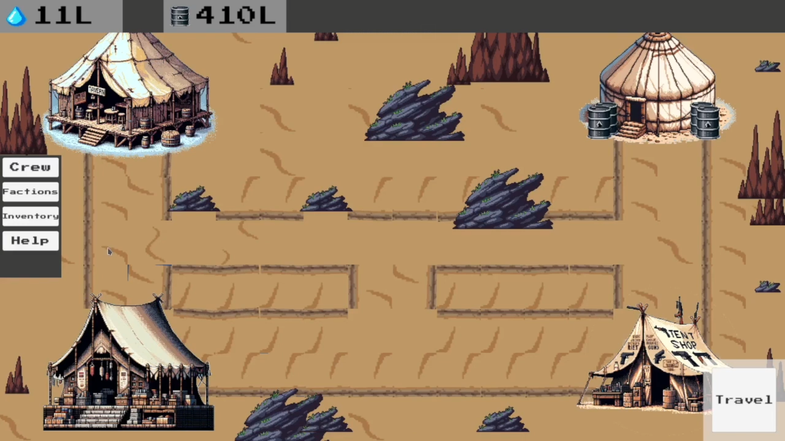
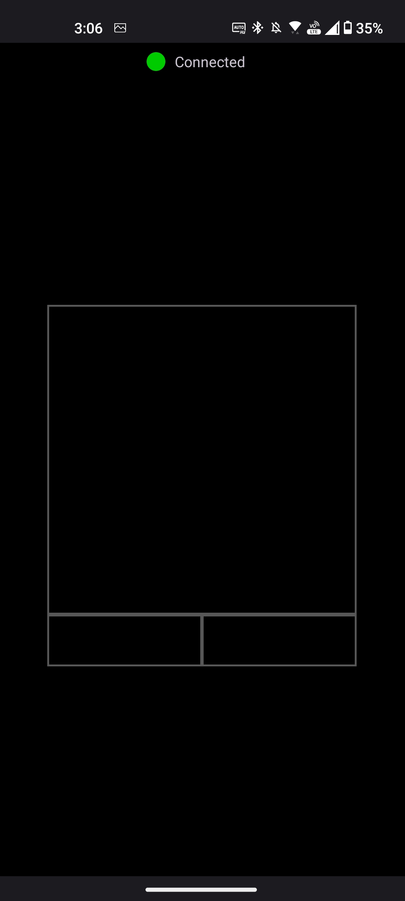
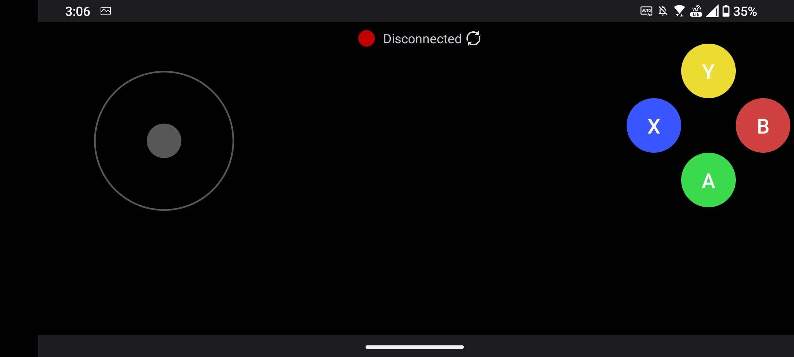
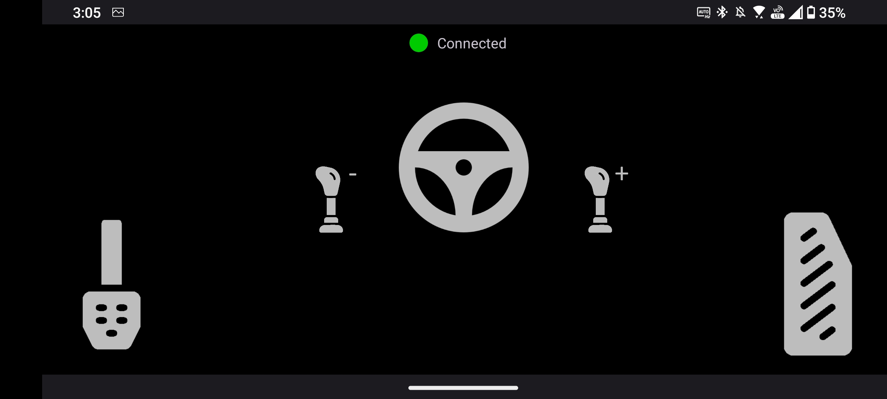

# Portfolio
A repository containing key pieces of work I have made or participated in.

## Games
All the games listed here were made using the Unity game engine with C#
- Proto 1
  - A 2D rouge like shooter
  - Very primitive as I made this in sixth form
- AAAA Experience
  - A short demo, 3D puzzle game with narative 
  - Made in coolaboration with another coursemate
  - Responsible for most of the programming and game narative

 

- Beyond the Edge
  - A short demo, 2D survivial adventure game 
  - Made in coolaboration with another coursemate
  - Responsible for all programming and game narative  

 

## Mobile Apps
- HIDtoolkit
  - Android app which allows for emulation of HID controllers such as a mouse on any computer
  - Currently allows emulation of Mouse, Gamepad, Steering Wheel
  - Java

 

